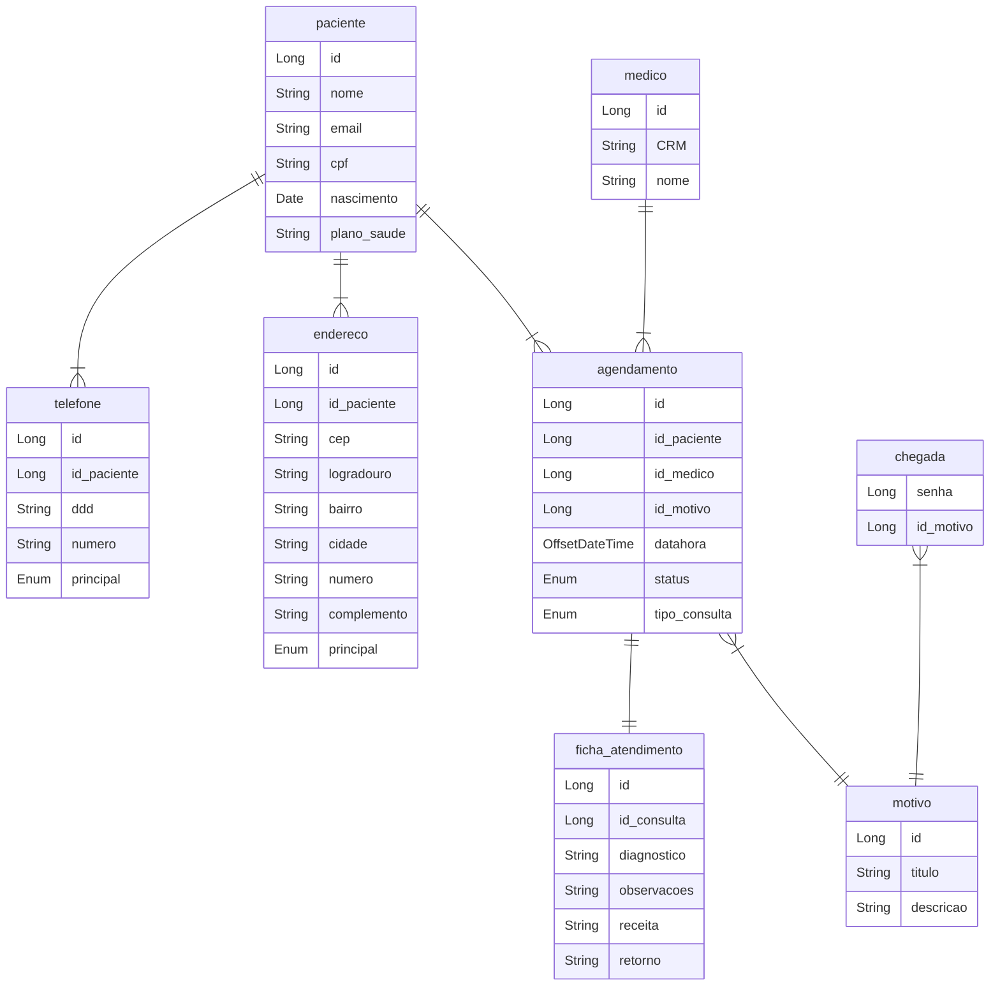

# Projeto de Consultório médico

Este é um projeto para um consultório médico, no qual é possível realizar o cadastro de pacientes, agendar consultas, registrar a ordem de chegada e manter uma ficha de atendimento. O sistema oferece a funcionalidade de agendamento de consultas, permitindo que os pacientes escolham a data e o horário desejados para sua consulta médica.

Os pacientes podem ser cadastrados no sistema, fornecendo informações pessoais, como nome, data de nascimento, informações de contato e plano de saúde. Com esses dados registrados, eles têm a opção de agendar uma consulta com um médico disponível, selecionando a data e o horário mais convenientes.

Após o agendamento, a consulta é reservada e o paciente receberá uma confirmação. No dia da consulta, o paciente deve comparecer ao consultório e será registrado na ordem de chegada. Essa ordem permite uma organização eficiente do atendimento, garantindo que os pacientes sejam atendidos de acordo com a ordem de chegada.

Durante a consulta, o médico preencherá uma ficha de atendimento, registrando informações relevantes, como diagnóstico, tratamento realizado e observações adicionais. Essa ficha de atendimento ficará associada à consulta realizada, proporcionando um histórico completo do atendimento para referência futura.

Com todas essas funcionalidades integradas, o consultório médico terá um sistema de gerenciamento de consultas, proporcionando aos pacientes uma experiência mais conveniente, reduzindo o tempo de espera e melhorando o atendimento como um todo.

## Modelo Entidade Relacionamento 

A seguir, apresentamos o MER atualizado do projeto:

